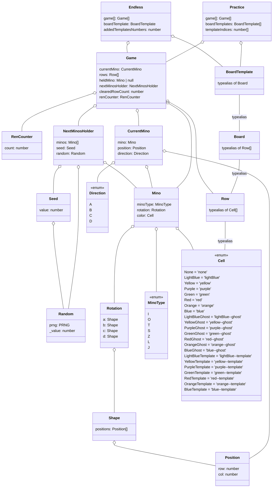

```mermaid
classDiagram

class RenCounter {
  count: number
}

class Random{
  prng: PRNG
  _value: number
}

class Seed {
  value: number
}
Seed o-- Random

class NextMinosHolder {
  minos: Mino[]
  seed: Seed
  random: Random
}
NextMinosHolder o-- Mino
NextMinosHolder o-- Seed
NextMinosHolder o-- Random

class Direction {
  <<enum>>
  A
  B
  C
  D
}

class Position {
  row: number
  col: number
}

class Shape {
  positions: Position[]
}
Shape o-- Position


class Rotation {
  a: Shape
  b: Shape
  c: Shape
  d: Shape
}
Rotation o-- Shape

class MinoType {
  <<enum>>
  I
  O
  T
  S
  Z
  L
  J
}

class Mino {
  minoType: MinoType
  rotation: Rotation
  color: Cell
}
Mino o-- MinoType
Mino o-- Rotation
Mino o-- Cell

class CurrentMino {
  mino: Mino
  position: Position
  direction: Direction
}
CurrentMino o-- Mino
CurrentMino o-- Position
CurrentMino o-- Direction

class Game {
  currentMino: CurrentMino
  rows: Row[]
  heldMino: Mino | null
  nextMinosHolder: NextMinosHolder
  clearedRowCount: number
  renCounter: RenCounter
}
Game o-- CurrentMino
Game o-- Row
Game o-- Mino
Game o-- NextMinosHolder
Game o-- RenCounter

class Cell {
  <<enum>>
  None = 'none'

  LightBlue = 'lightBlue'
  Yellow = 'yellow'
  Purple = 'purple'
  Green = 'green'
  Red = 'red'
  Orange = 'orange'
  Blue = 'blue'

  LightBlueGhost = 'lightBlue--ghost'
  YellowGhost = 'yellow--ghost'
  PurpleGhost = 'purple--ghost'
  GreenGhost = 'green--ghost'
  RedGhost = 'red--ghost'
  OrangeGhost = 'orange--ghost'
  BlueGhost = 'blue--ghost'

  LightBlueTemplate = 'lightBlue--template'
  YellowTemplate = 'yellow--template'
  PurpleTemplate = 'purple--template'
  GreenTemplate = 'green--template'
  RedTemplate = 'red--template'
  OrangeTemplate = 'orange--template'
  BlueTemplate = 'blue--template'
}

class Row {
  typealias of Cell[]
}
Row -- Cell : typealias

class Board {
  typealias of Row[]
}
Board -- Row : typealias

class BoardTemplate {
  typealias of Board
}
BoardTemplate -- Board : typealias

class Endless {
  game[]: Game[]
  boardTemplate: BoardTemplate
  addedTemplatesNumbers: number
}
Endless o-- Game
Endless o-- BoardTemplate

class Practice {
  game[]: Game[]
  boardTemplates: BoardTemplate[]
  templateIndices: number[]
}
Practice o-- Game
Practice o-- BoardTemplate
```
